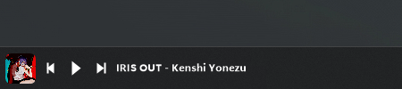
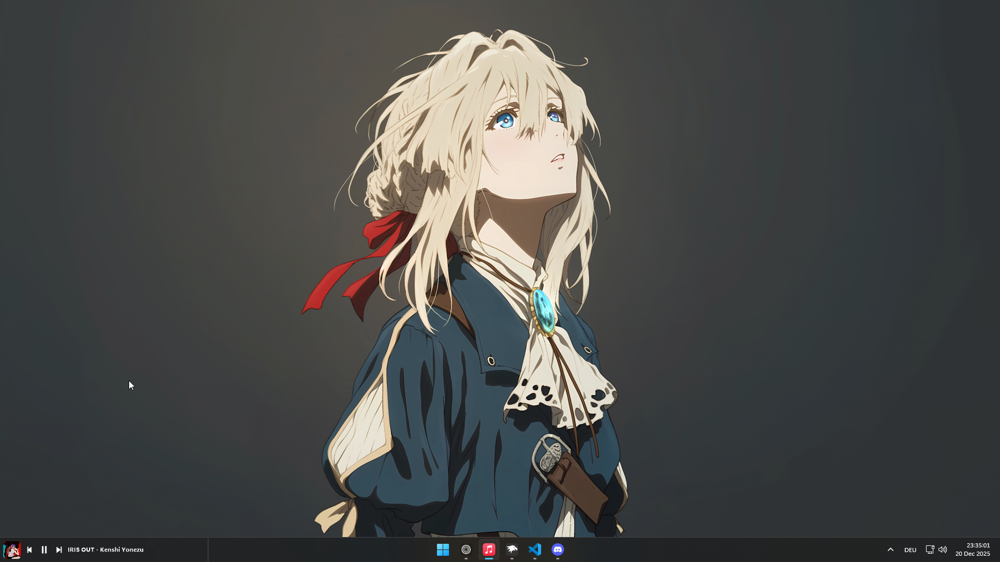

# Taskbar Player

Thanks to `Hashah2311` for the original `Taskbar Music Lounge` mod.

Now playing in taskbar with media controls.

## ✨ Features
- **Universal Support:** Works with any media player via GSMTC.
- **Album Art:** Displays current track cover art.
- **Controls:** Play/Pause, Next, Previous.
- **Volume:** Scroll over widget to adjust volume.

## ⚠️ Requirements
- **Disable Widgets:** Taskbar Settings -> Widgets -> Off.

## 🖼️ Images:

Without Border: 

With Border: 

Full Desktop: 

## ✅ Todo:

- Better fullscreen application handling (ignore mouse or hide)
- Show Artist below title maybe?